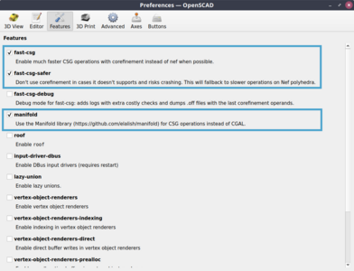
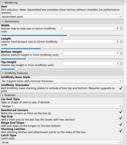
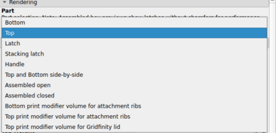
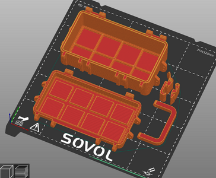
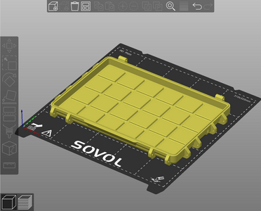
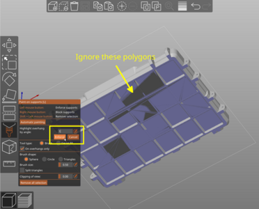
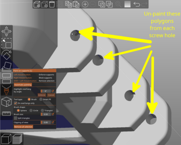
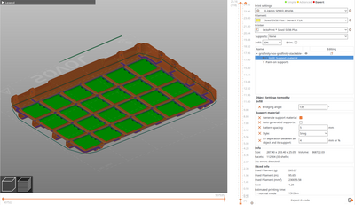
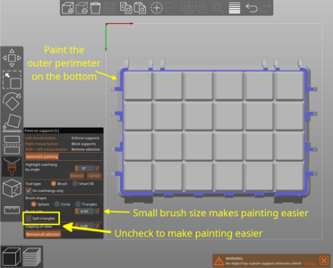
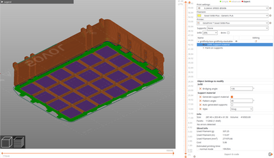

# Gridfinity Rugged Storage Box, Parametric and Customizable

![This model is a work in progress][work-in-progress-badge]
[![CC-BY-SA-4.0 license][license-badge]][license]

A Gridfinity compatible parametric and customizable rugged storage box or
toolbox for OpenSCAD. Make and customize your own boxes!

# Description

My [Rugged Storage Box][rugged-box-base-model], now for [Gridfinity][gridfinity]
bins!

Inspired by
[several][rugged-gridfinity-box-by-pjotrstrong]
[other][gridfinity-storage-box-by-pred]
[terrific][gridbox-by-bilbodd]
[Gridfinity][fully-printable-gridfinity-box-by-lennard-hoting]
[box][rugged-gridfinity-box-by-peterdesigns]
[models][rugged-gridfinity-box-lid-insert-by-zanfar],
I built a Gridfinity rugged box model of my own! This is a parametric model
which can create boxes of any size. I chose [OpenSCAD][openscad] so the software
and model would be fully open source.

## Features

Gridfinity:

* Configurable sizing in Gridfinity grid units
* Optional exterior stacking grid on top/bottom of box

Box options:

* Choice of latch style (clip or draw)
* Side stacking latches
* Optional handle
* Top opening grip and hinge end stops
* Lip seal, integrated or for 1.75mm filament
* Reinforced (thicker) corners
* Optional third hinge for large boxes

## Hardware and Tools

The hinges and latches are attached using M3 screws, **M3x40** by default.
Depending on whether a handle or stacking latches are desired, a box may take
between 6 and 25 screws to assemble.

My boxes are assembled using M3x40 and M3x55 hex socket head cap screws
(DIN 912):

* M3x40 ([AliExpress 1][m3x40-aliexpress-1], [AliExpress 2][m3x40-aliexpress-2],
  [Amazon][m3x40-amazon], [Trimcraft Aviation RC][m3x40-trimcraftaviationrc])
* M3x55 ([AliExpress][m3x55-aliexpress], [Amazon][m3x40-amazon])
  -- if attaching the optional handle

To assemble boxes with three stacking latches per side and/or a third hinge, a
hex allen key matching your screws is needed since a drill/driver won't fit. M3
hex socket head cap screws use 2.5mm drive, so a ~6" 2.5mm hex allen key is
needed for these
([Home Depot][2.5mm-hex-allen-key-hd], [Amazon][2.5mm-hex-allen-key-amazon]).

### Screw length formula

* All screws except for boxes with handles:
  * `Latch Width` (default 28mm) + 2 x `Rib Width` (default 6mm).
    At default values, `28 + 2 * 6 = 40`, or M3x40 screws.
  * To use M3x30 screws, set `Latch Width` to 22 and `Rib Width` to 4.

* For boxes with handles, replace two of the above screws with:
  * `Latch Width` (default 28mm) + 3 x `Rib Width` (default 6mm) + handle
    thickness (10mm).
    At default values, `28 + 3 * 6 + 10 = 56`, or about M3x55 screws.

## Rendering

### OpenSCAD version and configuration

Two OpenSCAD options are available which greatly improve rendering speed, but
are currently only in the development snapshots. You can download a development
snapshot from [the OpenSCAD downloads page][openscad-download] (scroll down
about half way).

After installation, open **Edit** > **Preferences**, and in **Features**,
enable:

* fast-csg
* fast-csg-safer
* manifold

### Model setup

See [the top-level README.md](/README.md) for libraries installation.

### Model rendering

Ensure both `rugged-box-gridfinity.scad` and `rugged-box-library.scad` are
placed in the same directory. Open `rugged-box-gridfinity.scad` in OpenSCAD.

Select your desired dimensions and options in the OpenSCAD Customizer. Then, one
at a time, select each part (top, bottom, latch, stacking latch, handle) in the
Part drop-down. For each part, perform a render (F6) and export to STL (F7).

### Recommended model configuration

*tl;dr:*

* Box parts with different **Gridfinity Stackable** settings are not compatible.
  Print all your box parts with this value enabled or disabled, not a mix of
  both.
* Set **Top Height** to 2
* Set **Bottom Height** to 4, 7, or 10 for a 6, 9, or 12 Gridfinity unit tall
  box, respectively
* To use stacking latches, boxes must have the same **Width** and a multiple of
  2 for **Length**
* Use **draw** latches for boxes 9 or more units tall, or **clip** latches for
  shorter boxes

Boxes with the **Gridfinity Stackable** option modify the placement of the
internal Gridfinity baseplate and top bases to accomodate the exterior stacking
base and baseplate. Therefore both the top and bottom of the box must be printed
with the same value for this option; do not mix and match. Additionally,
stacking latches will not reach the correct height between the two types of
boxes.

I recommend keeping most of the box height in the bottom, so Gridfinity bins
will be more contained in the box when the lid is open. I render my box tops
with **Top Height** set to **2** (7mm Gridfinity units).

Most of my Gridfinity bins are multiples of 3 units high (e.g. 3 or 6). I
therefore like to print boxes that are multiples of 3 units high. For a total
box height at a multiple of 3, I set **Bottom Height** to the desired box height
minus my **Top Height** of 2. For example, to make a box that is 9 total
Gridfinity units tall, I set **Top Height** to **2** and **Bottom Height** to
**7**.

If using the stacking latches feature, boxes will stack if they are the same
**Width** (left to right) and have stacking latch attachments at consistent lengths
on the side. To produce boxes with consistent attachment points, set **Length**
(front to back) to a multiple of 2 Gridfinity units. For example, a 6 unit wide
and 4 unit long box can use stacking latches with another box of the same size,
or with a 6 unit wide and 6 unit long box.

Front latches: I prefer draw latches but they are taller, so clip latches are also
available. I recommend using draw latches for boxes with a total height of 9
Gridfinity units or more. Smaller boxes should use clip latches.

Larger boxes use more filament, but result in more storage space per amount of
filament and time spent to print.

## Printing

### Printer preparation

These boxes are (usually) large prints. Clean your print bed and ensure it is
reasonably level.

### General print settings

The following instructions are for slicing with PrusaSlicer.

My boxes are printed in PETG at 0.24mm layer height, with 2 perimeters and 20%
adaptive cubic infill. I printed my latches and handle at 0.2mm layer height,
with 3 perimeters and 30% adaptive cubic infill.

Print the box top and bottom parts on their outer faces. Latches print on their
side. For the latches, a brim may be helpful for bed adhesion.

For boxes without exterior Gridfinity stacking (**Gridfinity Stackable** model
option), the box tops and bottoms print without supports.

For boxes with exterior Gridfinity stacking, see
"Additional print settings for Gridfinity Stackable boxes" below.

#### Reinforcing the box attachment ribs

PrusaSlicer can configure this model to use a higher infill on specific parts,
such as the attachment ribs (where screws are installed). The model includes
optional modifier volumes to make this simple.

To render a modifier volume in the OpenSCAD model, open and configure the box
model the same as the box model you'd like to print. Then, in the **Part**
drop-down, select and render each of:

* Top print modifier volume for attachment ribs
* Bottom print modifier volume for attachment ribs

This will produce a model that is just the attachment ribs without the box body.
Render and export each of these models.

In PrusaSlicer, load the box model to print. Then, in the Plater view,
right-click on the box model to open the context menu. Select **Add Modifier**
-> **Load...**, and then select the modifier volume for the matching part
(bottom/top). The modifier volume should perfectly overlap with the existing
model.

Finally, locate the added modifier volume model in the right sidebar next to the
Plater view. Right-click on the modifier volume, and select **Infill** to
override the infill settings for that volume. Then, enter your desired infill
percentage for the ribs (e.g. 100%).

Now the model is configured to slice the ribs with 100% infill!

### Additional print settings for Gridfinity Stackable boxes

Boxes with the **Gridfinity Stackable** model option require supports and
additional settings to print for both the box top and bottom.

#### Box top

The box top prints upside down. Supports are needed for each grid of the
integrated Gridfinity baseplate.

OpenSCAD renders the exterior stacking grid on the box top with some errant
zero-thickness polygons that make manually painting supports difficult. (These
don't affect the printed box.)

With the support painting tool (hotkey **L**):

* Next to the **Highlight overhang by angle** value, click the edit button and
  enter **1**.
* Click **Enforce** to automatically paint supports.

This method paints the integrated Gridfinity baseplate, and additionally the
very top overhang on all the screw holes with supports. The screw hole overhangs
do not need supports, so these should be removed. With the support painting tool
still selected:

* Uncheck **Split triangles** near the bottom of the paint settings. This will
  speed up the manual (un-)painting process
* **Shift+Left-click** on each of the inner screw hole overhang polygons to
  remove the painted supports from the screw holes

Finally, configure these print settings for the box top:

* Enable **Support material > Generate support material** (Enable supports)
* Disable **Support material > Auto-generated supports** (Add supports only to
  the painted areas)
* Set **Support material > Style** to **Snug**. Organic supports use more
  material and require longer to print.
* Set **Support material > Pattern spacing** to **5**. This decreases the amount
  of support material used.
* Set **Support material > XY separation between and object and its support** to
  **4**. This ensures a border between the support bases and gridfinity base
  square edges for easier support removal.
* Set **Infill > Bridging angle** to **135**. This sets the first Gridfinity
  baseplate layer visible on the box top to print at an angle, for a better
  finished look. Avoid setting this to 45, as that causes the first and second
  model layers to be printed at the same angle which is undesirable.

#### Box bottom

The box bottom prints upright. Supports are needed for the outer perimeter
that overhangs the base Gridfinity grid.

With the support painting tool (hotkey **L**):

* Uncheck **Split triangles** near the bottom of the paint settings. This will
  speed up the manual painting process.
* Set **Brush size** to a small value, such as **0.5**. This will make the
  painting process easier.
* Rotate the model so the underside is visible.
* **Left-click** to paint supports on the outer perimeter that overhangs the
  base Gridfinity grid.

Finally, configure these print settings for the box bottom:

* Enable **Support material > Generate support material** (Enable supports)
* Disable **Support material > Auto-generated supports** (Add supports only to
  the painted areas)
* Set **Support material > Style** to **Snug**. Organic supports use more
  material and require longer to print.
* Set **Support material > Pattern angle** to **45** (or 135). By default, snug
  supports print in straight horizontal lines which would result in very long
  single lines drawn around two of the box sides. Setting this to 45 or 135
  causes the support pattern to be properly staggered around the entire box.
* Set **Infill > Bridging angle** to **135**. This sets the first box body layer
  on the underside of the main box body to print at an angle, for a better
  finished look. Avoid setting this to 45, as that causes the first and parts of
  the second model layers to be printed at the same angle which is undesirable.

If you are reconfiguring your slicer after preparing the box top, restore these
settings to their default values:

* **Support material > Pattern spacing** (default 2mm).
* **Support material > XY separation between and object and its support**
  (default 60%).

## Assembly

**Important**: Don't overdrive the screws into the screw holes. They just need
to be attached to fasten the hinges and latches, and for the latches to clip on
to when the box is closed.

Place the box top onto the box bottom, and install screws into the hinges.

Attach the front and side stacking latches with additional screws. If attaching
a handle to the front, use two longer screws for the front latch screw on the
bottom in order to attach the handle.

**Note**: For large boxes with a three stacking latches per side and/or the
optional third hinge, install the center hinge/latch screws first with an allen
key before installing the remaining hinge/latch screws.

## Enjoy!

I had a lot of fun creating this model. Please share your feedback and makes!

## Differences of the remix compared to the original

This uses [Gridfinity Rebuilt in OpenSCAD][gridfinity-rebuilt-openscad] to add
[Gridfinity][gridfinity]-compatible baseplates and stacking covers to my
[Rugged Storage Box][rugged-box-base-model].

## Attribution and License

This model is licensed under [Creative Commons (4.0 International License) Attribution-ShareAlike][license].

This is a remix of
[**Gridfinity Rebuilt in OpenSCAD** by **kennetek**][gridfinity-rebuilt-openscad].

[Gridfinity][gridfinity] and
[Gridfinity Rebuilt in OpenSCAD][gridfinity-rebuilt-openscad]
use the [MIT License][gridfinity-license].

[2.5mm-hex-allen-key-amazon]: https://amazon.com/dp/B005G2RMLM
[2.5mm-hex-allen-key-hd]: https://www.homedepot.com/p/203195203
[fully-printable-gridfinity-box-by-lennard-hoting]: https://www.printables.com/model/369813-fully-printable-gridfinity-box-parametric
[gridbox-by-bilbodd]: https://www.printables.com/model/325677-gridbox
[gridfinity-license]: LICENSE.gridfinity
[gridfinity-rebuilt-openscad]: https://github.com/kennetek/gridfinity-rebuilt-openscad
[gridfinity-storage-box-by-pred]: https://www.printables.com/model/543553-gridfinity-storage-box-by-pred-now-parametric
[gridfinity]: https://www.youtube.com/watch?v=ra_9zU-mnl8
[license-badge]: /_static/license-badge-cc-by-sa-4.0.svg
[license]: http://creativecommons.org/licenses/by-sa/4.0/
[m3x40-aliexpress-1]: https://www.aliexpress.us/item/3256805665122576.html
[m3x40-aliexpress-2]: https://www.aliexpress.us/item/2251832624557792.html
[m3x40-amazon]: https://amazon.com/dp/B0CFQN9P7Y/
[m3x40-trimcraftaviationrc]: https://www.trimcraftaviationrc.com/index.php?route=product/product&product_id=481
[m3x55-aliexpress]: https://www.aliexpress.us/item/3256802885431338.html
[m3x55-amazon]: https://amazon.com/dp/B0BGM9N73R/
[openscad-download]: https://openscad.org/downloads.html
[openscad]: https://openscad.org
[printables-badge]: /_static/printables-badge.png
[printables-model]: https://www.printables.com/model/637028
[rugged-box-base-model]: ../../rugged-box/
[rugged-gridfinity-box-by-peterdesigns]: https://www.printables.com/model/495142-rugged-gridfinity-box-parametric
[rugged-gridfinity-box-by-pjotrstrong]: https://www.printables.com/model/361829-rugged-gridfinity-box
[rugged-gridfinity-box-lid-insert-by-zanfar]: https://www.printables.com/model/491142-rugged-gridfinity-box-lid-insert
[work-in-progress-badge]: /_static/work-in-progress-badge.svg
