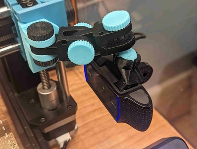
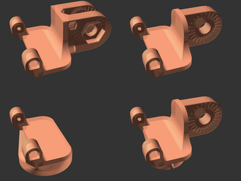
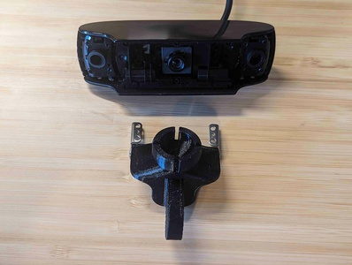
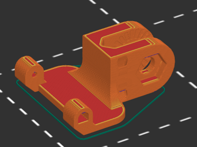
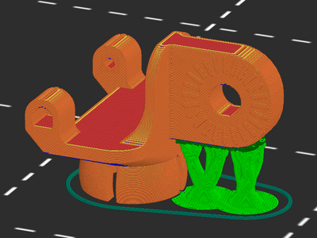
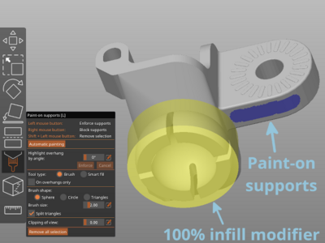
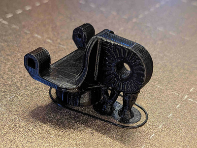
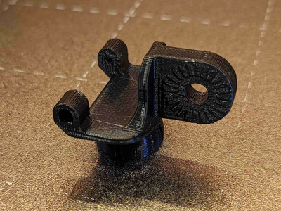
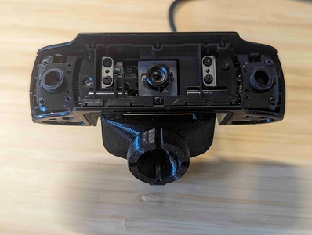

# Logitech C920 low profile adapter for articulating camera mount

[![Available on Printables][printables-badge]][printables-model]
[![CC-BY-4.0 license][license-badge]][license]

Low profile Logitech C920 adapter for Sneaks' articulating camera mount system

# Description

Use this mount to attach a Logitech C920 webcam to
[Sneaks' articulating camera mount system][original-model-url]!
This mount provides an articulating link attachment and/or a ball joint
attachment, and replaces the built-in mount. Plus, the mount can be further
customized in [OpenSCAD][openscad]!

## Camera disassembly

As this mount replaces the built-in mount on the Logitech C920, some disassembly
of the camera is needed to remove the built-in mount.
I watched [this video][c920-disassembly-video] and read
[this guide][c920-disassembly-guide] to learn how to dissasemble my camera.
You'll want a phillips 00-size screwdriver or similar.

Save the metal hinge inserts to use with the new printed adapter.

## Printing

Several model variants are included, and you can further customize your specific
adapter using the included OpenSCAD model.

For all adapter variations, I recommend:

* Print with something other than PLA (I used PETG). The hinge housings are
  small to fit on the camera, and PLA is more brittle than other materials.

Adapters with an articulated link and no ball mount are straightforward to
print, and require no supports.

For adapters with ball mounts, I additionally recommend:

* Clean your print bed. I had a few false starts printing these until I did so.
* Set the bottom 9mm to 100% infill, for strength on the ball mount part.
* Print at slower speeds. These can be printed without supports, but the contact
  area with the bed is small. I limited my printer to 60mm/sec for this print.

Adapters with both a ball mount and articulated link attachment are provided.
These models need supports on the articulated link to print as the ball mount
raises the rest of the model off of the print bed.

## Installation

Insert the metal hinge clips from the original Logitech C920 mount into the
hinge base on your printed adapter. Then, screw it onto the camera like the
original mount and reassemble the rest of the camera.

## Remixing

For further remixing, the included OpenSCAD model can create blank mount bases.
You can also extend the code with your own parts. The included articulated mount
STL file used in the OpenSCAD model is from
[Sneaks' original model][original-model-url]. To use the OpenSCAD model, ensure
all the source files are in the same directory and then open
`logitech-c920-slim-adapter.scad` in OpenSCAD.

## See also

I attached my Logitech C920 and new adapter to my articulated mount using
[darkcoffee's steel ball nut remix][darkcoffee-ball-nut].

Also pictured is my
[Sovol SV06 / SV06 Plus x-axis articulating mount base!](/sovol-sv06-plus/xaxis-articulating-mount-right/)

## Attribution and License

This is a remix of
[**Articulating Raspberry Pi Camera Mount for Prusa MK3 and MK2** by **Sneaks**][original-model-url].

Both the original model and this remix are licensed under
[Creative Commons (4.0 International License) Attribution][license].

[c920-disassembly-guide]: https://www.ifixit.com/Guide/Logitech+C920+Webcam+Disassembly/115077
[c920-disassembly-video]: https://www.youtube.com/watch?v=a39iWgSwaBk
[darkcoffee-ball-nut]: https://www.printables.com/model/577816-steel-ballnut-for-articulating-raspberry-pi-camera
[license-badge]: /_static/license-badge-cc-by-4.0.svg
[license]: http://creativecommons.org/licenses/by/4.0/
[openscad]: https://openscad.org
[original-model-url]: https://www.printables.com/model/3407-articulating-raspberry-pi-camera-mount-for-prusa-m
[printables-badge]: /_static/printables-badge.png
[printables-model]: https://www.printables.com/model/654585
