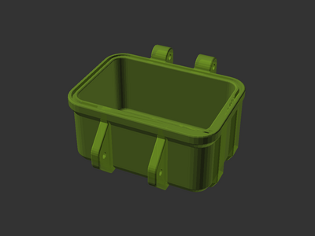
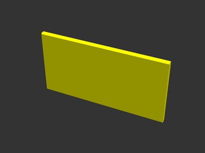
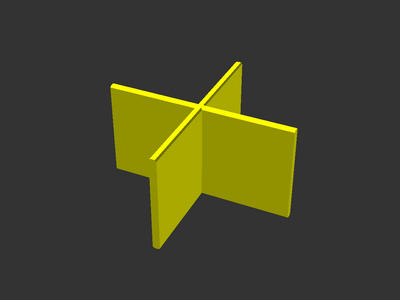
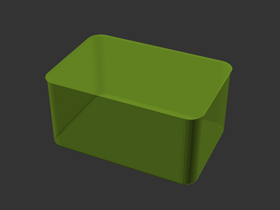
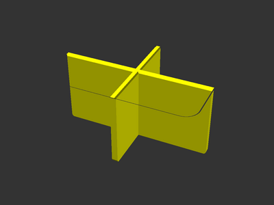

# Rugged box customization tutorial: Box With Dividers

Tutorial for
[**Rugged Storage Box** model][printables-model] by
[**bulbasaur0** on Printables](https://www.printables.com/@bulbasaur0_1139994).

Follow this tutorial to create a rugged box with four compartments.


## Setup

There are two ways to obtain the model files:

* Clone the [source git repository][github-source] (`git clone
  https://github.com/smkent/monoscad`). The model code will be placed into the
  `monoscad/rugged-box/` directory where the clone was performed.
* Download all of the [model files from Printables][printables-model] and
  extract them all to the same directory.

This tutorial will use build on the model's `rugged-box-library.scad` file.

The code for each step of this tutorial is in the included
`tutorial-box-with-dividers.scad` model file.

## Create New File

Create a new empty `.scad` file in the model directory, and open it in OpenSCAD.
Add a line:

```openscad
include <rugged-box-library.scad>;
```

If the OpenSCAD console does not show an error after saving your file, the
include step worked and you can start your model!

## Step 1: Rugged box initialization

The `rbox` module wraps all other rugged box code we'll write. It sets
dimensions and various other properties which can be used in your model.
Let's start with this:

```openscad
rbox(60, 40, 30)
```

This configures a box with a width of 60, length of 40, and bottom height of 30.
(We are not rendering the top and so have omitted a top height.)

Now, a part may be added as a child module to `rbox`. As the goal is to create a
box bottom with dividers, use `box_bottom`:

```openscad
rbox(60, 40, 30)
box_bottom();
```

OpenSCAD should now render the box bottom.



## Step 2: Divider module

Now, let's create a module to use as a divider. We can do this with a simple
cube, sized to match the box' dimensions. Add this module:

```openscad
module divider() {
    divider_length = $b_curved_inner_width;
    rbox_for_interior()
    translate([0, 0, $b_inner_height / 2])
    cube([divider_length, $b_wall_thickness, $b_inner_height], center=true);
}
```

All `$b_*` variables are initialized by the `rbox` module. Here, we've used:

* `$b_curved_inner_width`: The inside width of the box, plus the width of the
  small top curves on the inner lip. (`$b_inner_width` is similar, but excludes
  the curved lip size.)
* `$b_inner_height`: The inside height of the box. This value is set for the
  current box half (top or bottom). Keep reading for how to let OpenSCAD know
  which part our module is for.
* `$b_wall_thickness`: The thickness of the main box walls.

This also uses the `rbox_for_interior` modifier, which raises the child modules
on the Z axis from 0 to the interior box base height (same as the wall
thickness).

For `$b_inner_height` to be set, the `divider` module must be placed within a
top or bottom part module. Add `divider` within `rbox_bottom`:

```openscad
rbox(60, 40, 30)
rbox_bottom() {
    color("yellow")
    divider();
}
```

Before continuing, let's examine the new divider without the box in the way.
While `rbox_bottom` renders the box bottom, we can render parts *for* a box
bottom without actually rendering the bottom using `rbox_for_bottom`. Update
your model code to use `rbox_for_bottom`:

```openscad
rbox(60, 40, 30)
rbox_bottom() {
    color("yellow")
    divider();
}
```

OpenSCAD should now render just the divider.


## Step 3: Rounded divider module

The rugged box model has curved edges, and dividers can be made to match. Using
`offset`, we can create a rounded square and then use `linear_extrude` to turn
that into a 3D shape. Replace your `divider` module with this:

```openscad
module divider() {
    divider_length = $b_curved_inner_width;
    rotate([90, 0, 90])
    translate([0, 0, -divider_length / 2])
    linear_extrude(height=divider_length)
    offset($b_edge_radius)
    offset(-$b_edge_radius)
    translate([0, $b_outer_height / 2])
    square([$b_wall_thickness, $b_outer_height], center=true);
}
```

`$b_edge_radius` is the box' edge radius curve size.

The curved divider should be the same size as the previous `cube` divider.



## Step 4: Two dividers

The box can be divided into four total compartments by placing two dividers
crossing each other. First, make one change to the `divider` module, for the
`divider_length` calculation. Replace:

```openscad
divider_length = $b_curved_inner_width;
```

with:

```openscad
divider_length = max($b_curved_inner_length, $b_curved_inner_width);
```

This ensures the dividers will always be as big as the longest box dimension.

Then, the `divider` module just needs to be repeated. Update your model code to
place two dividers, one of which is rotated:

```openscad
rbox(60, 40, 30)
rbox_for_bottom() {
    color("yellow")
    for (rot = [0:1:1]) {
        rotate([0, 0, rot ? 90 : 0])
        divider();
    }
}
```

Now two crossing dividers should be visible.



## Step 5: Rugged box interior shape

The dividers we've created are too long for the box length. Even if we set the
dividers to the box' interior dimensions, they wouldn't necessarily fit if the
box's outer chamfer amount was changed. Fortunately, parts can be made to fit
the exact interior shape.

The `rbox_interior` module renders the interior shape of the box. Temporarily
comment out the `divider` calls and add `rbox_interior` to see the interior
shape:

```openscad
rbox(60, 40, 30)
rbox_for_bottom() {
    rbox_interior();
    // color("yellow")
    // for (rot = [0:1:1]) {
    //     rotate([0, 0, rot ? 90 : 0])
    //     divider();
    // }
}
```



## Step 6: Fit dividers to interior shape

We can now use the `rbox_interior` shape to cut the divider parts for an exact
fit! Uncomment the `divider` calls. Then, place the `divider` and
`rbox_interior` modules within an `intersection` block:

```openscad
rbox(60, 40, 30)
rbox_for_bottom() {
    intersection() {
        rbox_interior();
        color("yellow")
        for (rot = [0:1:1]) {
            rotate([0, 0, rot ? 90 : 0])
            divider();
        }
    }
}
```

The dividers are now sized for the box interior.



## Step 7: Finished!

All that's left is to re-add the box bottom itself. Change `rbox_for_bottom` to
`rbox_bottom` in your model file to see your completed box model!

The full model should now be:

```openscad
module divider() {
    divider_length = max($b_curved_inner_length, $b_curved_inner_width);
    rotate([90, 0, 90])
    translate([0, 0, -divider_length / 2])
    linear_extrude(height=divider_length)
    offset($b_edge_radius)
    offset(-$b_edge_radius)
    translate([0, $b_outer_height / 2])
    square([$b_wall_thickness, $b_outer_height], center=true);
}

rbox(60, 40, 30)
rbox_bottom() {
    color("yellow")
    render()
    intersection() {
        rbox_interior();
        for (rot = [0:1:1]) {
            rotate([0, 0, rot ? 90 : 0])
            divider();
        }
    }
}
```

The divider box is now complete!


[github-source]: https://github.com/smkent/monoscad/tree/main/rugged-box
[printables-model]: https://www.printables.com/model/637028
